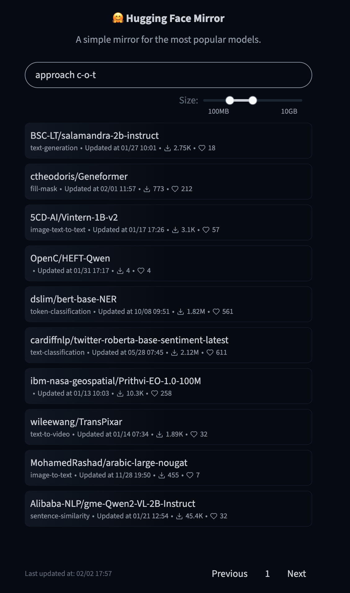

# HF Trending Mirror

A service that mirrors and indexes trending models from Hugging Face Hub, providing searchable access to model repositories and their metadata.

- Maintain a list of the top trending HF models
- Maintain the repo content of said models
- Provide an API endpoint to search models' README and filter by repo size
- Display a simple UI to use the search functionality

## Getting Started

### Prerequisites

- Node (v20 or later)
- Docker and Docker Compose
- Git lfs

### Installation

1. Clone the repository:

```bash
git clone git@github.com:clementsirieix/hugging-face-mirror.git
cd hugging-face-mirror
```

2. Set up environment variables:

```bash
cp .env.base .env
```

3. Start the infrastructure:

```bash
docker compose up -d
```

4. Install dependencies and build the project:

```bash
npm install
npm run build
```

### Running the Application

For production:

```bash
npm run start
```

Access the application at `http://localhost:3000`

For development:

```bash
# Start the server
npm run dev

# Start the frontend bundler
npm run dev:client
```

## API References

### Get Jobs

```http
GET /api/jobs
```

Retrieve the history of cron jobs with pagination support.

| Parameter | Type                       | Description                               |
| --------- | -------------------------- | ----------------------------------------- |
| `limit`   | `number`                   | Maximum number of jobs to return (max:50) |
| `page`    | `number`                   | Page number for pagination                |
| `key`     | `string`                   | Filter by job key                         |
| `status`  | `completed,failed,pending` | Filter by job status                      |

```typescript
type Response = {
    data: Array<{
        _id: string;
        key: string;
        status: JobStatus;
        startTime: string;
        endTime?: string;
        log?: string;
    }>;
    pagination: {
        total: number;
        page: number;
        limit: number;
        pages: number;
    };
};
```

### Get Job Models

```http
GET /api/jobs/:jobId/models
```

Search models associated with a specific job, with support for full-text search and filtering.

| Parameter | Type            | Description                                              |
| --------- | --------------- | -------------------------------------------------------- |
| `limit`   | `number`        | Maximum number of models to return (max:50)              |
| `page`    | `number`        | Page number for pagination                               |
| `search`  | `string`        | Full-text search query for README content                |
| `sort`    | `trendingScore` | Sort field with optional direction (e.g. -trendingScore) |
| `sizeGte` | `number`        | Filter by repository size greater than or equal in bytes |
| `sizeLte` | `number`        | Filter by repository size less than or equal in bytes    |

```typescript
{
    data: Array<{
        id: string;
        author: string;
        gated: boolean | string;
        inference: string;
        likes: number;
        trendingScore: number;
        private: boolean;
        sha: string;
        downloads: number;
        tags: string[];
        pipeline_tag: string;
        library_name: string;
        createdAt: string;
        modelId: string;
        siblings: Record<string, unknown>[];
        lastModified: string;
    }>;
    pagination: {
        total: number;
        page: number;
        limit: number;
        pages: number;
    }
}
```

## Observations

1. To maintain a copy of the trending models I decided to go with an express server that will use node-cron to run recurring jobs.
   I assume that the trending models on HF are not real-time so it should be enough to sync on a daily basis.
   The cron job will store the server metadata in a MongoDB database for safe-keeping with the associated job. Note that the cleanup job is not part of this implementation.
   For storing the repositories, I want to avoid long blocking operations as it has a large cost in terms of resources and can fail during execution, so I opted to use a simple SQS queue that will handle messages and let the consumers send the data to a S3 storage.
   Note that HF provides the authors with the ability to "gate" the content of their repository, so we will skip those. I also added 2 endpoints: 1 to get the (cron) jobs, and a second one to get the models saved by a job.
   The second assumption is to consider that indexing/calculating the size of the repo can be done over time rather than keeping track of the progress state.

2. For the full-text search I've added Elasticsearch to our setup, it will receive the content of the README.md and index it. We then use the indexes in our models endpoint to find the relevant models.

3. For the repository size I updated the storage consumer to count the size of the files (either directly or by using the git lfs pointer size), this can then be added to our Elasticsearch index.

4. For the frontend I used a simple React application using Tailwindcss for styling, and Tanstack React Query for state management while using the Vite bundler.

5. After running a test for backing the aimed goal I get:
    - The 10k models in db
    - Out of the 10k backed models, 9627 are not gated
    - With 10 consumers I can store on average 1.8 repo/s
    - The system requirements for the use-case are high and past 5000 stored repos my personal system starts to degrade.


